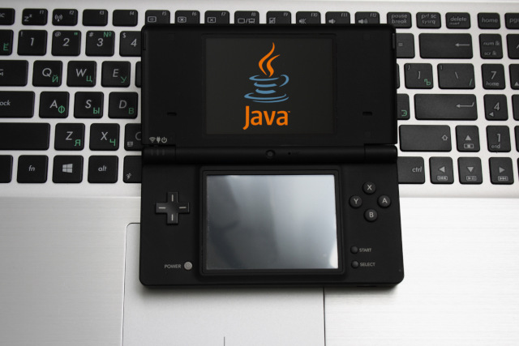
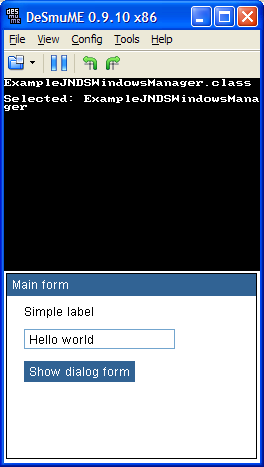
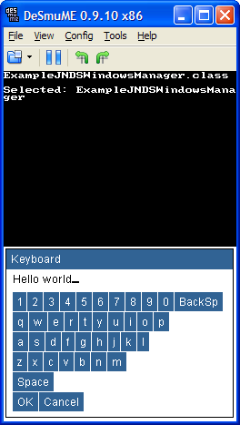

# Java NintendoDS windows manager

### Introduction

The project is a window manager for the KVM Java virtual machine executable on the Nintendo DS console. Show this article for details: https://habr.com/ru/post/468971/

### Screenshots

